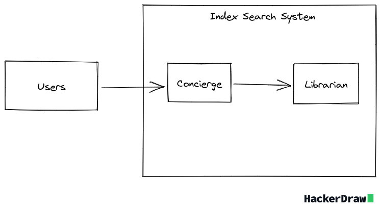
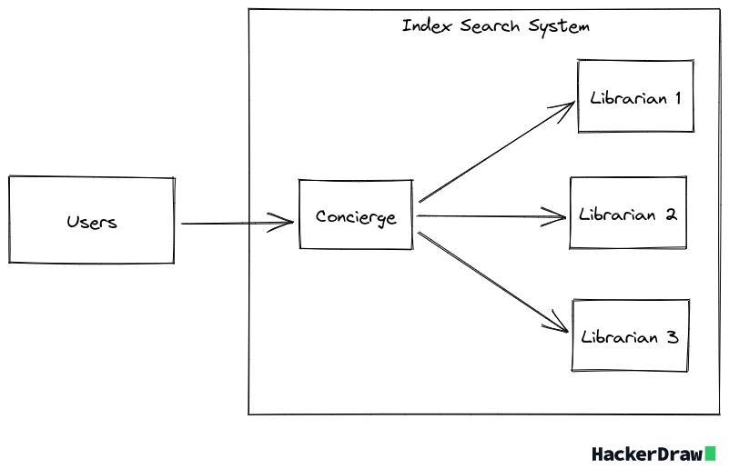

# Index Search


<p align="left">
  <a href="#introduction">Introduction</a> •
  <a href="#how-to-use">How to Use</a> •
  <a href="#credits">Credits</a> •
  <a href="#resources">Resources</a>
</p>

## [Introduction](#introduction)

Index search is a simple search engine that uses an inverted index to search for documents. It is a simple search engine that can be used to search for documents in a collection of documents. From the collection of documents, the search engine returns the documents that contain the search query and orders them by relevance.

## [Use Cases](#use-cases)

The search engine can be used in the following scenarios:

- Searching for documents in a collection of documents
- Ordering documents by relevance

## [Project Structure](#project-structure)

The project is written in Go. And the components of the project are:

- **Front End**: This
- **Concierge**: This is the component that is used to interact with the search engine. It is the component that is used to add documents to the collection of documents and to search for documents in the collection of documents. The concierge uses the librarian to add documents to the collection of documents and to search for documents in the collection of documents.
- **Librarian**: This is the component that is used to create the inverted index. The inverted index is a data structure that is used to store the words in the documents and the documents that contain the words. The indexer is used to create the inverted index from a collection of documents. This component is also used to search for documents in the collection of documents. The searcher uses the inverted index to search for documents that contain the search query and orders them by relevance.



In order to show the distributed nature of the search engine, the project is divided into two services:

- **Concierge Service**: This is the service that is used to interact with the search engine.
- **Librarian Service**: This is the service that is used to create the inverted index.

And to bring about Fault Tolerance, the project is structured to have 1 concierge service and 3 librarian services. The rationale behind this is that the concierge service is the service that is used to interact with the search engine and it is the service that is most likely to be used by the users. And the librarian service is the service that is used to create the inverted index and it is the service that is most likely to be used by the concierge service. So, in order to bring about fault tolerance, the librarian service is replicated 3 times.



## [How to Use](#how-to-use)

The components / services are dockerized and there is a `docker-compose.yaml` file that will spawn the instances. Docker compose will instantiate the instances and in turn will notify the `concierge` component where to find the `librarian` components.

Therefore, to run the project.

1. Clone the project

```bash
git clone https://github.com/ffekirnew/index-search.git
```

2. Change to the root directory of the project.

```bash
cd index-search
```

3. Install Docker
4. Install Docker Compose
5. Run docker comose

```bash
sudo docker compose up
```

6. Change to the front-end directory

```bash
cd front-end
```

7. Run the front end

```bash
npm run start
```
